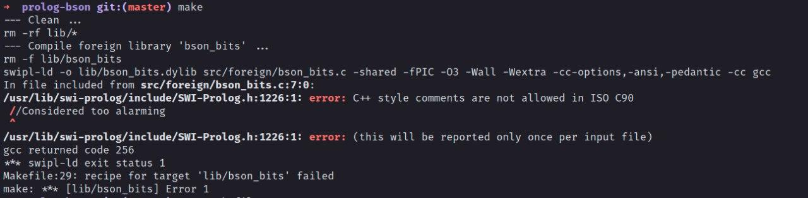

# Prolonguemos

**Disciplina**: FGA0210 - PARADIGMAS DE PROGRAMAÇÃO - T02

**Nro do Grupo**: 02

**Paradigma**: Lógico

## Alunos
|Matrícula | Aluno |
| -- | -- |
| 16/0124581  | Hugo Aragão de Oliveira |
| 16/0123186  | Guilherme Guy de Andrade |
| 16/0121612  | Gabriela Barrozo Guedes |
| 15/0135521  | Leonardo dos S. S. Barreiros |


## Sobre

<p align="justify">O projeto Prolonguemos foi desenvolvido pelo corpo discente da disciplina de Paradigmas de programação no ano de 2020 pela Universidade de Brasília.

<p align="justify"> Através do DataSet da Yelp, realizamos a classificação de restaurantes por estados e cidades dos Estados Unidos. Evidenciando também os 3 primeiros colocados do ranking.

<p align="justify"> Nós utilizamos o <strong>Mongo</strong> para realizar a importação dos dados. Em seguida realizamos os tratamentos necessários em Prolog para determinar nossos fatos.

<p align="justify"> Para podermos realizar os tratamentos em Prolog utilizamos o <strong>Prolongo</strong>, que é uma biblioteca de mongo compatível com o SWI-Prolog.

## Screenshots
Adicione 2 ou mais screenshots do projeto em termos de interface e/ou funcionamento.

## Instalação

__Importante__: Para não ocorrer nenhum tipo de incompatibilidade instale a versão do Swi-Prolog.

- __swi-prolog=7.6.4+dfsg-1build1__

Para poder instalar rode o seguinte comando:

``` sh
sudo apt-get install swi-prolog=7.6.4+dfsg-1build1
```

Fazemos uso das seguintes dependências:

#### Git

``` sh
sudo apt-get install git
```

#### Gcc
``` sh
sudo apt-get install gcc
```

#### Prolongo

- https://github.com/khueue/prolongo

#### Mongo

- https://www.mongodb.com/

#### Docker

- https://docs.docker.com/engine/install/

Afim de não ter nenhum tipo de impasse optamos por criar um docker para podermos ter um ambiente adequado e estavel para rodar o projeto.

## Uso
Para utilizar nosso projeto, siga as seguintes instruções:

1. Baixe o DataSet da Yelp;
1.1. Dentro da pasta crie uma pasta na raiz chamada yelp, caso não exista;
1.2. Cole o arquivo do DataSet na pasta yelp/ -- tem formato .tar;
2. Rode o comando ``` docker-compose up -d``` para criar o container do mongo em sua maquina;
2.1. Rode o comando ``` make db ``` para extrair e importar os dados para dentro do container do mongo;
3. Rode o comando ``` make lib ``` para clonar as bibliotecas utilizadas no projeto;
4. Agora é necessário que as bibliotecas sejam compiladas, para isso rode os seguintes comandos:
__OBS__: rode a partir da raiz do repositório;
4.1. ``` cd lib/prolog-bson && make && cd ../prolongo/ && make```
<p align="justify"><strong>OBS</strong>: Nesta etapa poderá acontecer o erro mencionado em <strong>Possíveis Erros</strong>. Devido a versão do gcc da maquina o Makefile da lib prolog-bson poderá dar erro.

### Possíveis Erros



<p align="justify"> Caso o seguinte erro apareça na hora de buildar o <strong>prolog-bson</strong>, é necessário que remova a flag <strong>-ansi</strong> do MakeFile.

#### Rodar o projeto 

Para rodar o projeto, a partir da raiz do repositório rode o seguinte comando:

``` sh
swipl main.pl
```

ou

``` sh
make run
```

Em seguida dentro do terminal interativo do Swi-Prolog rode o seguinte comando para rodar os scripts do projeto:

```sh
main.
```

## Vídeo
Adicione 1 ou mais vídeos com a execução do projeto.

## Outros 
O Dataset utilizado pela equipe está disponível logo abaixo, deve ser baixado no formato __JSON__:

- https://www.yelp.com/dataset/download

__OBS__: Para que seja realizado o download do Dataset o site necessita de alguns dados. Porém não precisa ser dados verídicos. A finalidade deste formulário é desconhecido. Entretanto, este Dataset já foi utilizado antes em outras discíplinas e não foi apresentado nenhum tipo de rísco pelo uso e pela exposição dos dados necessários no formulário.

## Fontes

1. [Yelp Dataset]( https://www.yelp.com/dataset)
1. [Docker](https://docs.docker.com/)
1. [Mongo DB](https://www.mongodb.com/)
1. [Prolongo](https://github.com/khueue/prolongo)