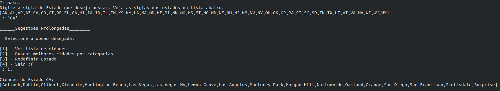
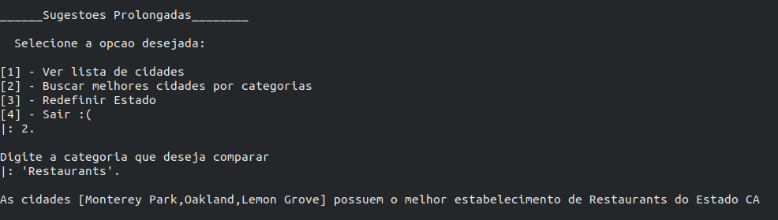
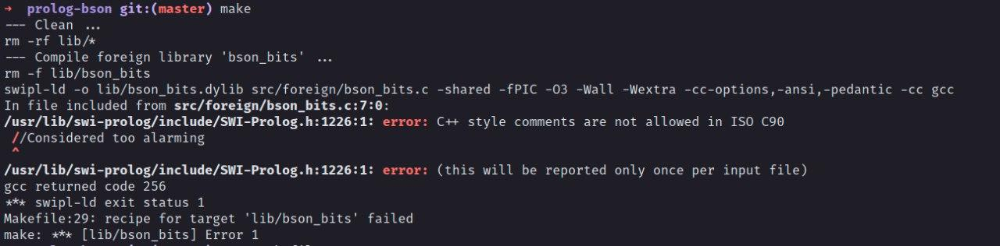
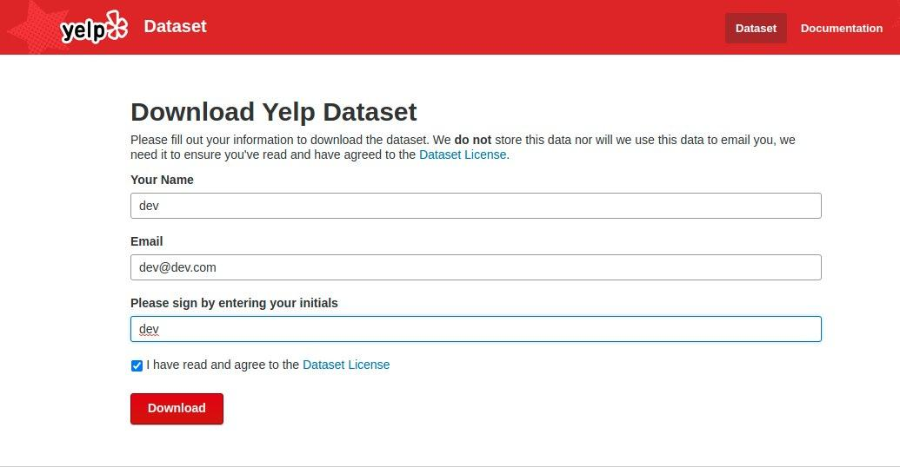
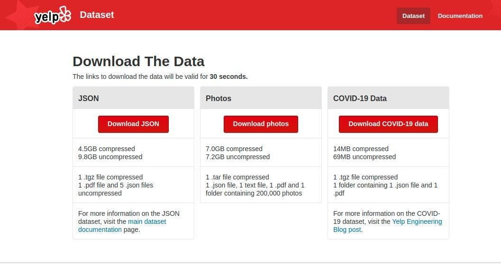
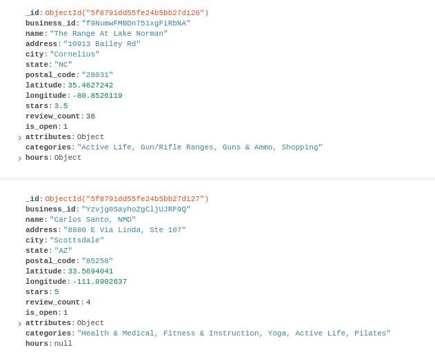

# Prolonguemos

**Disciplina**: FGA0210 - PARADIGMAS DE PROGRAMAÇÃO - T02

**Nro do Grupo**: 02

**Paradigma**: Lógico

## Alunos
|Matrícula | Aluno |
| -- | -- |
| 16/0124581  | Hugo Aragão de Oliveira |
| 16/0123186  | Guilherme Guy de Andrade |
| 16/0121612  | Gabriela Barrozo Guedes |
| 15/0135521  | Leonardo dos S. S. Barreiros |


## Sobre

<p align="justify">O projeto Prolonguemos foi desenvolvido pelo corpo discente da disciplina de Paradigmas de programação no ano de 2020 pela Universidade de Brasília.

<p align="justify"> Através do DataSet da Yelp, realizamos a classificação de estabelecimentos por estados e cidades dos Estados Unidos. Evidenciando até as 3 primeiros cidades colocadas no ranking.

<p align="justify"> Nós utilizamos o <strong>Mongo</strong> para realizar a importação dos dados. Em seguida realizamos os tratamentos necessários em Prolog para determinar nossos fatos.

<p align="justify"> Para podermos realizar os tratamentos em Prolog utilizamos o <strong>Prolongo</strong>, que é uma biblioteca de mongo compatível com o SWI-Prolog.

## Screenshots



## Instalação

<p align="justify"><strong>Importante:</strong> Para não ocorrer nenhum tipo de incompatibilidade instale a versão do Swi-Prolog.

- __swi-prolog=7.6.4+dfsg-1build1__

<p align="justify">Para poder instalar rode o seguinte comando:

``` sh
sudo apt-get install swi-prolog=7.6.4+dfsg-1build1
```

<p align="justify">Fazemos uso das seguintes dependências:

#### Git

``` sh
sudo apt-get install git
```

#### Gcc
``` sh
sudo apt-get install gcc
```

#### Docker

<p align="justify">Afim de não ter nenhum tipo de impasse optamos por criar um docker para podermos ter um ambiente adequado e estavel para rodar o banco de dados projeto. Veja o link abaixo para a instalação.

- https://docs.docker.com/engine/install/

#### Mongo

<p align="justify">Utilizamos o Mongo para o banco de dados do projeto, ele roda em um container via <strong>docker-compose</strong>. Veja no <a href="#passo2uso">passo 2 do uso</a> como subir o Mongo.

- https://www.mongodb.com/

#### Prolongo

<p align="justify">Biblioteca utilizada para acesso ao banco de dados Mongo, essa biblioteca é baixada pelo comando <strong> make lib</strong>, no <a href="#passo3uso">passo 3 do uso</a>. Veja abaixo o link do repositório do projeto da biblioteca. 

- https://github.com/khueue/prolongo


## Uso
<p align="justify">Para utilizar nosso projeto, siga as seguintes instruções:

1. <p align="justify">Baixe o DataSet da <a href="#downloadDataset">Yelp</a> e salve o arquivo na pasta <strong>/yelp</strong> (O arquivo deve estar no formato <strong>.tar</strong>);

2. <p align="justify" id="passo2uso">Crie e popule o banco de dados com os dados da yelp;
    
    1. <p align="justify">Suba o container do mongo em sua maquina:

        ``` sh
        docker-compose up -d
        ``` 

    2. <p align="justify">Importe os dados da yelp para o banco de dados:

        ``` sh
        make db
        ``` 
<p align="justify"><strong>O import dos dados demora um tempo, então busque um café enquanto carrega :)</strong>

3. <p align="justify" id="passo3uso"> Baixe as bibliotecas utilizadas no projeto:

    ``` sh
    make lib
    ``` 

4. <p align="justify">Agora é necessário que as bibliotecas sejam compiladas, para isso rode o seguinte comando:

    __OBS__: Rode a partir da raiz do repositório;

    ``` sh
    cd lib/prolog-bson && make && cd ../prolongo/ && make
    ```

<p align="justify"><strong>OBS</strong>: Nesta etapa poderá acontecer o erro mencionado em <strong>Possíveis Erros</strong>. Devido a versão do gcc da maquina o Makefile da lib prolog-bson poderá dar erro.

### Possíveis Erros



<p align="justify">Caso o seguinte erro apareça na hora de buildar o <strong>prolog-bson</strong>, é necessário que remova a flag <strong>-ansi</strong> das FLAGS definidas no MakeFile na pasta da biblioteca.

#### Rodar o projeto

<p align="justify">Para rodar o projeto, a partir da raiz do repositório rode o seguinte comando:

``` sh
swipl main.pl
```

ou

``` sh
make run
```

<p align="justify">Em seguida dentro do terminal interativo do Swi-Prolog rode o seguinte comando para rodar os scripts do projeto:

```sh
main.
```

## Observações necessárias

<p align="justify">Nós criamos um menu interativo. Viabilizando uma diversidade de dados. Portanto é <strong>necessário</strong>:

- O usuário deve passar como parâmetro o __Estado__;
- O usuário deve passar como parâmetro a __Categoria__;

__Os parâmetros devem ser passados com aspas simples__.

<p align="justify"><strong>É Case-sensitive, portanto deve passar os parâmetros conforme a listagem que for apresentada ao usuário.</strong>

<p align="justify"><strong>Dependendo o Estado escolhido o carregamento pode demorar um pouco.</strong>

<p><strong style="color: orange">Exemplo</strong></p>

<p align="justify">As siglas aceitas serão exibidas na tela no momento de inserção.

Alguns exemplos de categoria são: 'Pizza', 'Bakeries', ''. Caso queira outras categorias, acesse a base de dados atraves do mongo, para visualizar todas as possibilidades.

<p><strong style="color: green">estado: 'NY'</strong></p>
<p><strong style="color: green">categoria: 'Pizza'</strong></p>
<br>
<p><strong style="color: green">estado: 'SC'</strong></p>
<p><strong style="color: green">categoria: 'Bakeries'</strong></p>
<br>
<p><strong style="color: green">estado: 'SC'</strong></p>
<p><strong style="color: green">categoria: 'Bakeries'</strong></p>


###### Das funcionalidades do projeto

Temos como funcionalidade:

- Ver lista de cidades: Função que retorna a lista de todas as cidades cadastradas no Yelp de acordo com o estado.

- Buscar melhores cidades por categoria: Função que retorna as cidades ordenadas de acordo com o score na categoria selecionada.

- Redefinir Estado: Função para escolher um novo estado para realizar as funções anteriores.

- Sair: Função para sair do programa.

## Vídeo
O Vídeo pode ser acessado nesse [Link](https://youtu.be/Y3r-QRjGB8Q).

## Outros 
<p align="justify">O Dataset utilizado pela equipe está disponível logo abaixo, deve ser baixado no formato <strong>JSON</strong>:

- https://www.yelp.com/dataset/download

<p align="justify"><strong>OBS:</strong> Para que seja realizado o download do Dataset o site necessita de alguns dados. Entretanto, este Dataset já foi utilizado antes em outras discíplinas e não foi apresentado nenhum tipo de rísco pelo uso e pela exposição dos dados necessários no formulário.

#### Download Dataset

<p><strong style="color: orange">DataSet</strong></p>





<p><strong style="color: orange">Dados importados no mongo</strong></p>



<!-- ###### Aplicação

 -->


<h2 id="downloadDataset">Fontes</h2>

1. [Yelp Dataset]( https://www.yelp.com/dataset)
1. [Docker](https://docs.docker.com/)
1. [Mongo DB](https://www.mongodb.com/)
1. [Prolongo](https://github.com/khueue/prolongo)